# Migration Dependency Graph (R-134)

**Generated:** 2026-07-30 · **Repo:** `supabase/migrations/` (39 files) + `supabase/migrations_archive/` (1)
**Production project:** `kebqwsdguxxjsijahrox` · **Verification:** read-only; every status below was
confirmed object-by-object (columns, indexes, functions, RLS flags — not just table existence, because
several migrations `ALTER` rather than `CREATE`).

> **Do not classify a migration from the `supabase migration list` output alone.** A blank *Remote*
> column conflates "applied but unrecorded" with "never applied". This graph separates them.

## Legend

| Status | Meaning | Action |
|---|---|---|
| 🟩 **SAFE** | Applied in production, verified. Idempotent or guarded on rebuild. | Bookkeeping repair only |
| 🟦 **SYNCED** | Applied **and** already recorded remotely at this exact version. | Nothing — in sync |
| 🟨 **PENDING** | Not applied. Real schema change still owed to production. | Phase 3 decision |
| 🟧 **PARTIAL** | Some objects applied, some not. Idempotent → safe to re-run. | Phase 3 decision |
| 🟥 **DANGEROUS** | Applied, but re-running would damage a current database. | Guarded; never unguard |
| ⬛ **OBSOLETE** | Never applied and never should be. | Archived out of the CLI's path |

---

## Graph

```mermaid
graph TD
  BASE["BASE SCHEMA<br/>(orgs, profiles, calls, leads, tickets,<br/>appointments, agents, conversations, messages)<br/>NOT IN ANY MIGRATION — R-031 open"]

  subgraph ERA1["Era 1 · 2026-01 · applied by hand"]
    M1201["20241201 call_id"]:::safe
    M1202["20241202 agent config"]:::safe
    M1203["20241203 workspace_status"]:::safe
    M1204["20241204 agents RLS"]:::safe
    M1205["20241205 audit_log nullable"]:::safe
    M0101["20250101 analytics idx<br/>2 of 7 present"]:::partial
    M0115["20250115 tickets idx<br/>0 of 6 present"]:::pending
    M0120["20250120 requester"]:::safe
    M0121["20250121 phone"]:::safe
    M0122["20250122 updated_at"]:::safe
    M0123["20250123 auth_user_id"]:::safe
    M0124["20250124 dedupe + unique<br/>1 of 2 · has DELETEs"]:::partial
    M0125a["20250125 concurrency RPC"]:::safe
    M0125b["20250125 webhook_debug"]:::safe
    M0126["20250126 organizations to VIEW<br/>GUARDED"]:::danger
    M0127["20250127 plan catalog"]:::safe
    M0128["20250128 invoice runs"]:::safe
    M0129a["20250129 overage state"]:::safe
    M0129b["20250129 billing status"]:::safe
    M0130["20250130 paused_reason"]:::safe
    M0131["20250131 calls_today fn"]:::pending
    M0202["20250202 org_settings welcome"]:::safe
  end

  ARCH["20250201 profiles welcome<br/>ARCHIVED"]:::obsolete

  subgraph GAP["COMMIT GAP · 2026-01-29 to 2026-07-07 · applied direct to prod"]
    M0405a["20260405185422 RLS policies"]:::synced
    M0405b["20260405185454 org_settings FK to orgs"]:::synced
    M0405c["20260405185505 legacy FKs to orgs"]:::synced
    M0405d["20260405185521 DROP conversation_messages<br/>+ DROP organizations_legacy"]:::synced
  end

  subgraph ERA2["Era 2 · 2026-07 · sprint work"]
    IG1["20260722000251 instagram foundation"]:::synced
    IG2["20260722000302 instagram deletion"]:::synced
    M0723a["20260723000000 artifact_notifications"]:::pending
    M0723b["20260723100000 billing views baseline"]:::safe
    M0723c["20260723110000 RLS backstop<br/>7 tables STILL RLS OFF"]:::pending
    M0723d["20260723120000 usage alerts"]:::pending
    M0723e["20260723130000 agent business_context"]:::pending
    P0["20260724000000 employee_channels"]:::pending
    P1["20260724000100 contacts"]:::pending
    P2["20260724000200 conversations/messages cols"]:::pending
    P3["20260724000300 artifacts view"]:::pending
    INV["20260724200000 org_invites"]:::pending
    MAN["20260724210000 employee_manifests"]:::pending
  end

  BASE --> M1201 & M1204 & M1205 & M0121 & M0126
  M0121 --> M0122 --> M0123 --> M0124
  M0123 --> M0405a
  M0126 --> M0405b --> M0405c --> M0405d
  M0405d -.->|"drops table this<br/>would rename"| M0126
  BASE --> IG1 --> IG2
  IG1 --> P2
  M0723b --> M0723d
  P0 --> P1 --> P2 --> P3
  P1 -.->|"FK contacts(id)<br/>HARD ORDER"| P2
  P0 --> MAN
  M0405d -.->|"dropped conversation_messages<br/>breaks getAvgResponseTime.ts"| P2

  classDef safe fill:#1b5e20,stroke:#66bb6a,color:#fff
  classDef synced fill:#0d47a1,stroke:#64b5f6,color:#fff
  classDef pending fill:#e65100,stroke:#ffb74d,color:#fff
  classDef partial fill:#f9a825,stroke:#fff176,color:#000
  classDef danger fill:#b71c1c,stroke:#ef5350,color:#fff
  classDef obsolete fill:#37474f,stroke:#90a4ae,color:#fff
```

---

## 🟦 SYNCED (6) — applied *and* recorded at the same version. No action.

| Version | Name |
|---|---|
| `20260405185422` | `rls_calls_leads_tickets_appointments` |
| `20260405185454` | `migrate_organization_settings_fk_to_orgs` |
| `20260405185505` | `migrate_legacy_fks_to_orgs` |
| `20260405185521` | `cleanup_conversation_messages_and_legacy` |
| `20260722000251` | `instagram_foundation` |
| `20260722000302` | `instagram_data_deletion` |

The four `20260405*` were recovered into the repo at their exact remote versions (Commit `de8c225`), so
they need **no repair**. The Instagram pair was renamed to the versions MCP `apply_migration` recorded
(Commit `db0aa8e`), which is why renaming beat repairing: local and remote now agree on one version.

## 🟩 SAFE (17) — applied, verified; need bookkeeping repair only

`20241201000000` · `20241202000000` · `20241203000000` · `20241204000000` · `20241205000000` ·
`20250120000000` · `20250121000000` · `20250122000000` · `20250123000000` · `20250125010000` ·
`20250125020000` · `20250127000000` · `20250128000000` · `20250129000000` · `20250129000001` ·
`20250130000000` · `20250202000000` · `20260723100000`

*(`20250126000000` is applied too, but is listed under DANGEROUS.)*

## 🟨 PENDING (11) — genuinely not applied

| Version | Missing evidence | Blocks |
|---|---|---|
| `20260723110000_rls_backstop` | RLS **OFF on all 7** targets: `webhook_debug`, `personas`, `persona_tools`, `onboarding_activation_lock`, `billing_stripe_customers`, `billing_stripe_prices`, `billing_invoice_runs` | **Security** |
| `20260724000000_platform_employee_channels` | `employee_channels` absent | `PLATFORM_MODEL_ENABLED` |
| `20260724000100_platform_contacts` | `contacts`, `contact_identities` absent | ↑ and hard-blocks `…000200` |
| `20260724000200_platform_conversations_messages` | all added columns absent | ↑ |
| `20260724000300_platform_artifacts` | `artifacts` view absent | ↑ |
| `20260724200000_org_invites` | `org_invites` absent | R-010 member invites |
| `20260724210000_employee_manifests` | `employee_manifests` absent | Sprint 8 |
| `20260723000000_artifact_notifications` | table absent | R-008 |
| `20260723120000_billing_usage_alerts` | table absent | R-009 |
| `20260723130000_agent_business_context` | `agents.business_context` absent | R-013 |
| `20250115000000_add_tickets_indexes` | **0 of 6** indexes | perf only |

## 🟧 PARTIAL (2)

| Version | State | Note |
|---|---|---|
| `20250101000000_add_analytics_indexes` | 2 of 7 present | All `IF NOT EXISTS` → re-running is idempotent and safe |
| `20250124000000_deduplicate_profiles…` | `profiles_auth_user_id_unique` ✅, `profiles_email_unique` ❌ | ⚠️ contains **two `DELETE FROM public.profiles`**. Do **not** re-run. Verified 2026-07-30: 25 profiles / 25 distinct emails / 0 duplicates, so the DELETEs would remove 0 rows today — but the missing index should come from a new forward-only migration instead |

## 🟥 DANGEROUS (1)

`20250126000000_migrate_organizations_to_orgs_view` — applied in production, but its original Step 1 was
an unguarded `ALTER TABLE IF EXISTS public.organizations RENAME TO organizations_legacy`. Since
`20260405185521` dropped `organizations_legacy` and `public.organizations` is now a **VIEW** — and
PostgreSQL's `ALTER TABLE … RENAME` renames views too — re-running it would rename the live view away and
resurrect a phantom `organizations_legacy` view.

Guarded on `relkind='r'` in Commit `9cf7f2a`: identical behaviour on a fresh rebuild, no-op on any
database past `20260405185521`. **Never remove that guard.**

## ⬛ OBSOLETE (1)

`20250201000000_add_profiles_welcome_email_sent_at` → `supabase/migrations_archive/`. Never applied, zero
code references, superseded by `20250202000000`. See that directory's README.

---

## Hard ordering constraints

1. **`20260724000100` → `20260724000200`.** The latter declares
   `contact_id uuid REFERENCES public.contacts(id)`. If `contacts` does not exist, it **fails**.
   Timestamp order already enforces this — do not reorder or apply selectively.
2. **`20260405185454` → `20260405185505` → `20260405185521`.** FKs must be repointed to `orgs` before
   `organizations_legacy` can be dropped.
3. **Base schema first.** `orgs`, `profiles`, `calls`, `leads`, `tickets`, `appointments`, `agents`,
   `conversations`, `messages` exist in **no migration** — a clean rebuild from `supabase/migrations/`
   alone is impossible today. That is **R-031**, still open, and the single largest remaining gap.

## Known-stale documentation (to fix in Phase 4)

- **CLAUDE.md landmine #4** — "dual-write `orgs` + `organizations_legacy`" is false; `organizations_legacy`
  was dropped 2026-04-05.
- **CLAUDE.md RLS claim** — "RLS exists on a few tables but is NOT the enforcement layer" is false and
  hazardous: RLS is enabled on 13 of 14 tenant tables and is load-bearing for 60 files.
- **CLAUDE.md landmine #9** — the drift it describes is now reconciled on the repo side.
