# Migration Dependency Graph (R-134)

> ## ✅ EXECUTION STATUS — updated 2026-07-30
>
> **Step 1 of 2 is DONE. The original divergence is fully closed.**
>
> `supabase migration repair --status applied` was run for the 12 verified-APPLIED migrations.
> Confirmed by `supabase migration list`: **zero remote-only rows remain** — the "remote ahead of
> repo" problem that started this whole investigation no longer exists.
>
> Verified during execution (resolving an earlier open question): `migration repair` writes the
> **full** bookkeeping row — `version`, `name` *and* `statements` (e.g. `20241202000000` landed with
> 9 statements from the local file), not a bare version stub. So repaired history is complete and a
> future `db diff` reads it correctly.
>
> **Step 2 — applying the 22 outstanding migrations — is NOT done.** `supabase db push --include-all`
> is blocked by the environment's permission classifier. A `--dry-run` confirmed the exact set and
> order, and every pre-flight check passed (see "Pre-flight results" below). The single command to
> finish is at the bottom of this file.
>
> Current state: **18 in sync · 22 outstanding · 0 remote-only**.

**Generated:** 2026-07-30 · **Revised:** 2026-07-30 after exhaustive object verification
**Repo:** `supabase/migrations/` (39 files) + `supabase/migrations_archive/` (1)
**Production project:** `kebqwsdguxxjsijahrox` · **Verification:** read-only

> **Revision note.** The first version of this document classified 17 migrations as SAFE based on a
> *representative* object per migration. Exhaustive verification (every column, index, function, view and
> constraint in each file) reduced that to **12**. Nine migrations are only PARTIALLY applied. The pattern
> is consistent and diagnostic: **`ADD COLUMN` and `CREATE TABLE` landed; `CREATE INDEX` and
> `ADD CONSTRAINT` did not** — the signature of migrations pasted into the SQL editor in fragments rather
> than run end-to-end. Do not repair a PARTIAL migration: doing so permanently discards its missing half.

## Legend

| Status | Meaning | Action |
|---|---|---|
| 🟦 **SYNCED** (6) | Applied **and** recorded remotely at this exact version | Nothing |
| 🟩 **APPLIED** (12) | Every object verified present | Safe to repair |
| 🟧 **PARTIAL** (9) | Some objects present, some missing | **Never repair** — complete first |
| 🟨 **PENDING** (12) | No objects present | Phase 3 decision |
| 🟥 **DANGEROUS** (1) | Applied, but destructive if re-run | Guarded; never unguard |
| ⬛ **OBSOLETE** (1) | Never applied, never should be | Archived |

39 tracked + 1 archived. `20250126000000` is counted in both APPLIED and DANGEROUS.

---

## Graph

```mermaid
graph TD
  BASE["BASE SCHEMA — orgs, profiles, calls, leads,<br/>tickets, appointments, agents, conversations, messages<br/>IN NO MIGRATION · R-031 OPEN"]:::base

  subgraph ERA1["Era 1 · 2026-01 · applied by hand, in fragments"]
    M1201["20241201 call_id<br/>cols ok · 2 idx missing"]:::partial
    M1202["20241202 agent config · 8/8"]:::safe
    M1203["20241203 workspace_status<br/>cols ok · CHECK missing"]:::partial
    M1204["20241204 agents RLS"]:::safe
    M1205["20241205 audit_log nullable"]:::safe
    M0101["20250101 analytics idx<br/>2 of 7"]:::partial
    M0115["20250115 tickets idx<br/>0 of 6"]:::pending
    M0120["20250120 requester · 4/4"]:::safe
    M0121["20250121 phone"]:::safe
    M0122["20250122 updated_at"]:::safe
    M0123["20250123 auth_user_id"]:::safe
    M0124["20250124 dedupe+unique<br/>1 of 2 · HAS DELETEs"]:::partial
    M0125a["20250125 concurrency RPC · 3/3"]:::safe
    M0125b["20250125 webhook_debug · 3/3"]:::safe
    M0126["20250126 organizations to VIEW<br/>APPLIED · GUARDED"]:::danger
    M0127["20250127 plan catalog<br/>table ok · fn missing"]:::partial
    M0128["20250128 invoice runs<br/>5 cols ok · 3 idx missing"]:::partial
    M0129a["20250129 overage state<br/>table ok · 3 idx missing"]:::partial
    M0129b["20250129 billing status<br/>col+CHECK+idx missing"]:::partial
    M0130["20250130 paused_reason<br/>col ok · CHECK+idx missing"]:::partial
    M0131["20250131 calls_today fn"]:::pending
    M0202["20250202 org_settings welcome · 2/2"]:::safe
  end

  ARCH["20250201 profiles welcome<br/>ARCHIVED"]:::obsolete

  subgraph GAP["COMMIT GAP · 2026-01-29 to 2026-07-07 · applied direct to prod"]
    G1["20260405185422 RLS policies"]:::synced
    G2["20260405185454 org_settings FK"]:::synced
    G3["20260405185505 legacy FKs"]:::synced
    G4["20260405185521 DROP conversation_messages<br/>+ DROP organizations_legacy"]:::synced
  end

  subgraph ERA2["Era 2 · 2026-07 · sprint work"]
    IG1["20260722000251 instagram foundation"]:::synced
    IG2["20260722000302 instagram deletion"]:::synced
    N1["20260723000000 artifact_notifications"]:::pending
    V1["20260723100000 billing views · 8/8"]:::safe
    R1["20260723110000 RLS backstop<br/>7 tables STILL RLS OFF"]:::pending
    A1["20260723120000 usage alerts"]:::pending
    B1["20260723130000 agent business_context"]:::pending
    P0["20260724000000 employee_channels"]:::pending
    P1["20260724000100 contacts"]:::pending
    P2["20260724000200 convo/msg columns"]:::pending
    P3["20260724000300 artifacts view"]:::pending
    INV["20260724200000 org_invites"]:::pending
    MAN["20260724210000 employee_manifests"]:::pending
  end

  BASE --> M1201 & M1204 & M1205 & M0121 & M0126 & M0127
  M0121 --> M0122 --> M0123 --> M0124
  M0123 --> G1
  M0126 --> G2 --> G3 --> G4
  G4 -.->|"drops the table this<br/>would rename"| M0126
  M1203 --> M0129b --> M0130
  BASE --> IG1 --> IG2 --> P2
  V1 --> A1
  P0 --> P1 --> P2 --> P3
  P1 -.->|"FK contacts id<br/>HARD ORDER"| P2
  P0 --> MAN
  G4 -.->|"dropped conversation_messages"| P2

  classDef base fill:#263238,stroke:#78909c,color:#fff
  classDef safe fill:#1b5e20,stroke:#66bb6a,color:#fff
  classDef synced fill:#0d47a1,stroke:#64b5f6,color:#fff
  classDef pending fill:#e65100,stroke:#ffb74d,color:#fff
  classDef partial fill:#f9a825,stroke:#fff176,color:#000
  classDef danger fill:#b71c1c,stroke:#ef5350,color:#fff
  classDef obsolete fill:#37474f,stroke:#90a4ae,color:#fff
```

---

## 🟦 SYNCED (6) — no action

`20260405185422` · `20260405185454` · `20260405185505` · `20260405185521` · `20260722000251` · `20260722000302`

The four `20260405*` were recovered at their exact remote versions (`de8c225`), so they need **no repair**.
The Instagram pair was renamed to the versions MCP `apply_migration` recorded (`db0aa8e`) — which is why
renaming beat repairing: both sides now agree on one version.

## 🟩 APPLIED (12) — every object verified; safe to repair

| Version | Objects verified |
|---|---|
| `20241202000000` | 8/8 `agents.*` columns |
| `20241204000000` | `agents` RLS enabled + 1 policy |
| `20241205000000` | `audit_log.actor_user_id` `is_nullable=YES` |
| `20250120000000` | 4/4 requester columns |
| `20250121000000` | `profiles.phone` |
| `20250122000000` | `profiles.updated_at` |
| `20250123000000` | `profiles.auth_user_id` |
| `20250125010000` | 3/3 concurrency functions |
| `20250125020000` | table + 2/2 indexes |
| `20250126000000` | `organizations` view *(also DANGEROUS — see below)* |
| `20250202000000` | 2/2 columns |
| `20260723100000` | 8/8 billing views |

## 🟧 PARTIAL (9) — **never repair**; each is missing real objects

| Version | Present | Missing |
|---|---|---|
| `20241201000000` | `appointments.call_id`, `tickets.call_id` | `idx_appointments_call_id`, `idx_tickets_call_id` |
| `20241203000000` | `workspace_status`, `paused_at`, index | **`check_workspace_status` CHECK** |
| `20250101000000` | 2 indexes | 5 indexes |
| `20250124000000` | `profiles_auth_user_id_unique` | `profiles_email_unique` ⚠️ file has 2 `DELETE FROM profiles` |
| `20250127000000` | `billing_plan_catalog` | **`public.update_updated_at_column()`** |
| `20250128000000` | 5/5 columns | 3 indexes |
| `20250129000000` | `billing_overage_state` | 3 indexes |
| `20250129000001` | — | `billing_status` column, `check_billing_status`, index |
| `20250130000000` | `paused_reason` | **`check_paused_reason` CHECK**, index |

Two consequences worth calling out:

1. **The documented enums are not enforced in the database.** CLAUDE.md lists
   `workspace_status ∈ {active,paused}` and `paused_reason ∈ {manual,hard_cap,past_due}` as
   non-negotiable business rules, but `check_workspace_status` and `check_paused_reason` do not exist.
   Application code is currently the only guard.
2. **`20250127`'s missing function is independently corroborated.** Commit `4fee772` recorded that
   `public.update_updated_at_column()` does not exist in this database and caused an apply to fail and
   roll back. This confirms the partial-apply reading rather than a verification error.
3. **`20250129000001`'s missing column is deliberate.** `billing_status` is a *computed API field*
   (`api/billing/summary/route.ts:419` derives it from `workspace_status` + `paused_reason`), and
   `lib/billing/pause.ts:191` states outright: "Uses existing fields only (no billing_status column)".
   This one should be superseded, not completed.

## 🟨 PENDING (12) — no objects present

| Version | Missing | Blocks |
|---|---|---|
| `20260723110000_rls_backstop` | RLS **OFF on all 7** targets | **Security** |
| `20260724000000` | `employee_channels` | `PLATFORM_MODEL_ENABLED` |
| `20260724000100` | `contacts`, `contact_identities` | ↑, hard-blocks `…000200` |
| `20260724000200` | all added columns | ↑ |
| `20260724000300` | `artifacts` view | ↑ |
| `20260724200000` | `org_invites` | R-010 |
| `20260724210000` | `employee_manifests` | Sprint 8 |
| `20260723000000` | `artifact_notifications` | R-008 |
| `20260723120000` | `billing_usage_alerts` | R-009 |
| `20260723130000` | `agents.business_context` | R-013 |
| `20250115000000` | 0 of 6 indexes | perf |
| `20250131000000` | `calls_today_counts_by_phone_number` | perf |

## 🟥 DANGEROUS (1)

`20250126000000` — applied, but its original Step 1 was an unguarded
`ALTER TABLE IF EXISTS public.organizations RENAME TO organizations_legacy`. Since `20260405185521`
dropped `organizations_legacy` and `public.organizations` is now a VIEW — and PostgreSQL's
`ALTER TABLE … RENAME` renames views too — re-running it would rename the live view away and resurrect a
phantom. Guarded on `relkind='r'` in `9cf7f2a`. **Never remove that guard.**

## ⬛ OBSOLETE (1)

`20250201000000` → `supabase/migrations_archive/`. Never applied, zero code references, superseded by
`20250202000000`.

---

## Hard ordering constraints

1. **`20260724000100` → `20260724000200`** — a real FK (`contact_id REFERENCES contacts(id)`), not just
   timestamp ordering. Applying `…000200` without `…000100` **fails**.
2. **`20260405185454` → `185505` → `185521`** — FKs must move to `orgs` before `organizations_legacy` can
   be dropped.
3. **Base schema first** — `orgs`, `profiles`, `calls`, `leads`, `tickets`, `appointments`, `agents`,
   `conversations`, `messages` exist in **no migration**. A clean rebuild from `supabase/migrations/`
   alone is impossible today. **R-031**, still open, and the largest remaining gap.

## Known-stale documentation (Phase 4)

- **CLAUDE.md landmine #4** — `organizations_legacy` was dropped 2026-04-05; the "dual-write" claim is false.
- **CLAUDE.md RLS claim** — RLS is enabled on 13/14 tenant tables and load-bearing for 60 files.
- **CLAUDE.md landmine #9** — repo-side drift is now reconciled.
- **CLAUDE.md business rules** — the `workspace_status` / `paused_reason` enums are **not** DB-enforced.
