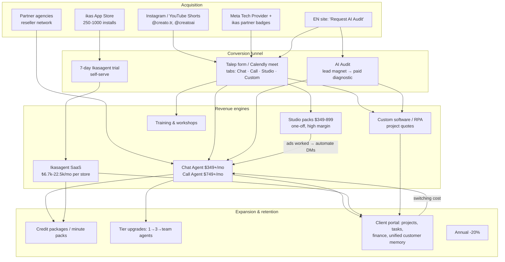
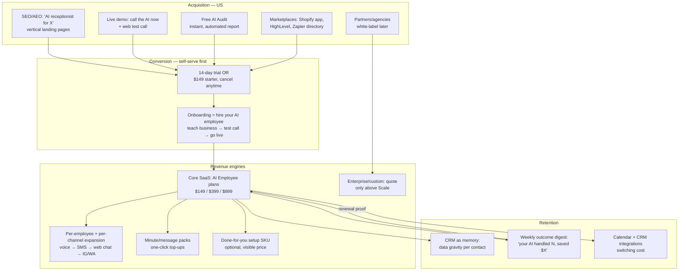

# 05 — Creato Business Model & Revenue Architecture

> Reconstructed from VERIFIED surfaces (pages, routes, admin machinery) + STRONGLY INFERRED flow
> logic. Audited 2026-08-25.

## 1. Creato revenue architecture

**Operational backbone (their real moat):** an internal agency OS — proposals + proposal
templates → payment links (iyzico/Stripe) → subscriptions + invoices → credit packages → partner
management → system logs — all VERIFIED as routes in their own product. The agency is run *as
software*, which is why 2 offices can serve "20+ brands" of custom work plus 250+ SaaS stores.

**Key business-model properties**
1. **Services fund the platform; the platform makes services scalable.** Custom projects and
   audits produce cash and case knowledge; every engagement runs on the same portal, making the
   marginal customer cheaper.
2. **Distribution is borrowed, not bought.** Meta partner badge (credibility), ikas app store
   (installs), partner agencies (sales force on revenue share). Near-zero paid acquisition
   fingerprint (only Meta Pixel + GA4; no ad-tech stack observed).
3. **Cash-flow-friendly pricing.** One-off packs (instant cash), monthly recurring with setup
   labor front-loaded, prepaid credits (negative working capital).
4. **AI cost pass-through.** Bundle copy states Meta/WhatsApp/LLM/telecom costs belong to the
   customer — Creato sells orchestration margin, not model margin.
5. **Community as brand** (CREATO AI Social, "Turkey's first AI community") — inbound authority
   in a market where AI expertise is scarce.

## 2. Weaknesses in the model (exploitable)

- **Human-in-the-loop scaling limit:** every horizontal sale requires a proposal + configuration
  labor; growth is headcount-coupled except in the ikas vertical.
- **Single-ecosystem concentration:** the self-serve engine depends on ikas's platform and Meta's
  APIs (both revocable).
- **No compounding content/SEO asset**; acquisition is social + partnerships only.
- **Proof debt:** revenue claims without named customers → ceiling on mid-market/enterprise trust.

## 3. Denku revenue architecture (US market design)

Design principle: **invert Creato where the US market demands it (self-serve, printed pricing,
proof), copy where mechanics are market-independent (ladder, credits, partners, vertical wedge).**

**Deliberate differences from Creato**
| Dimension | Creato | Denku US |
|---|---|---|
| Core motion | Sales-led, proposal-priced | Self-serve, printed pricing, card checkout (already built: Stripe) |
| Proof | Claims ("20+ brands") | Live demo number + instant audit + real usage stats — *demonstrable* proof before logos exist |
| Acquisition | Social + TR partnerships | SEO/AEO vertical pages + marketplace listings + live demo virality |
| Wedge vertical | ikas e-commerce | Pick ONE US vertical (doc 13 recommends home-services/clinics via missed-call capture) |
| Services | Core revenue | **Optional SKU only** (setup); no custom-software agency arm at launch |
| Enterprise | "Özel" everywhere | Deferred until SOC 2 path exists (marketing honesty rule) |

**What Denku must copy without shame**
1. The **offer ladder** (free proof → low-friction entry → recurring core → usage expansion →
   custom top) — Denku currently has only "recurring core."
2. **Credit/pack top-ups** alongside overage.
3. **Partner program** as phase-2 distribution (Denku's PARTNER_PLATFORM_PROPOSAL.md already
   sketches this; Creato validates it works at agency scale).
4. **Run-the-company-on-the-product** (self-agent): Denku's own inbound line and website chat
   should be handled by a Denku AI employee from day one — it is both QA and the best demo.
